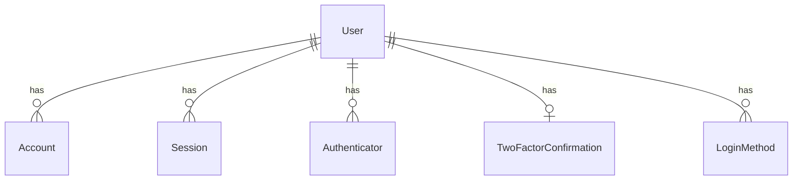

# Database Documentation

## Technology Stack

- Database System: PostgreSQL
- ORM: Prisma
- Migration Tool: Prisma Migrate

## Entity Relationship Model

## Tables

### User Table

Primary user table storing core user information.

| Column             | Type    | Description          |
| ------------------ | ------- | -------------------- |
| id                 | string  | Primary key (CUID)   |
| email              | string  | Unique email address |
| password           | string  | Encrypted password   |
| isTwoFactorEnabled | boolean | 2FA status           |
| loginAttempts      | integer | Security control     |

[See full schema](./schema.md)

## Security Considerations

### Password Storage

- Passwords are hashed using bcrypt
- No plaintext passwords stored
- Salt rounds: 10

### Token Management

- All tokens have expiration times
- One-time use for verification tokens
- Secure token rotation

[See security details](./security.md)

## Performance Optimization

### Indexing Strategy

- Primary key indices on all tables
- Unique indices for email, session tokens
- Foreign key indices for relationships

[See optimization guide](./optimization.md)

## Maintenance

### Cleanup Procedures

- Regular session cleanup
- Token purging
- Backup strategy

[See maintenance guide](./maintenance.md)
