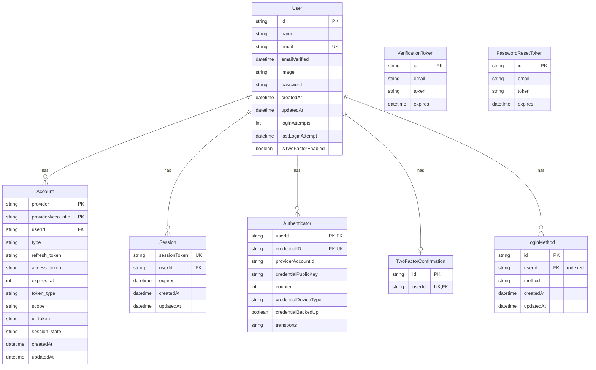

# 資料庫文檔

本文檔詳細說明了系統的資料庫結構和關聯。

## 資料庫技術棧

- **資料庫系統**: PostgreSQL
- **ORM**: Prisma
- **遷移工具**: Prisma Migrate

## 實體關係模型 (ER Model)

## 資料表說明

### User 表

主要用戶表，存儲用戶的核心信息。

- `id`: 主鍵，使用 CUID 生成
- `email`: 唯一索引，用戶的電子郵件
- `password`: 加密存儲的密碼
- `isTwoFactorEnabled`: 是否啟用兩步驗證
- `loginAttempts`: 登錄嘗試次數，用於安全控制

### Account 表

用戶的第三方帳號關聯表。

- 複合主鍵：`provider` + `providerAccountId`
- 支援多種 OAuth 提供者（如 Google、GitHub）
- 包含訪問令牌和刷新令牌信息

### Session 表

用戶會話管理表。

- `sessionToken`: 唯一的會話標識
- `expires`: 會話過期時間
- 與 User 表關聯，支援多會話

### Authenticator 表

用戶的驗證器信息表。

- 複合主鍵：`userId` + `credentialID`
- 存儲 WebAuthn/FIDO2 驗證器信息
- 支援多個驗證設備

### TwoFactorConfirmation 表

兩步驗證確認表。

- 每個用戶只能有一個確認記錄
- 用於追蹤兩步驗證狀態

### LoginMethod 表

用戶登錄方式表。

- 記錄用戶使用的所有登錄方式
- 支援多種登錄方法（密碼、社交媒體等）
- 包含創建和更新時間戳

### VerificationToken 表

電子郵件驗證令牌表。

- 用於電子郵件驗證流程
- 包含過期時間控制

### PasswordResetToken 表

密碼重設令牌表。

- 用於密碼重設流程
- 包含過期時間控制

## 關聯關係

1. User -> Account: 一對多關係

   - 一個用戶可以有多個第三方帳號
   - 刪除用戶時級聯刪除關聯帳號

2. User -> Session: 一對多關係

   - 一個用戶可以有多個活動會話
   - 刪除用戶時級聯刪除會話

3. User -> Authenticator: 一對多關係

   - 一個用戶可以註冊多個驗證器
   - 刪除用戶時級聯刪除驗證器

4. User -> TwoFactorConfirmation: 一對一關係

   - 每個用戶最多一個兩步驗證確認
   - 刪除用戶時級聯刪除確認記錄

5. User -> LoginMethod: 一對多關係
   - 一個用戶可以有多個登錄方式
   - 刪除用戶時級聯刪除登錄方式記錄

## 安全考慮

1. 密碼存儲

   - 使用者密碼經過加密後存儲
   - 不存儲明文密碼

2. 令牌管理

   - 所有令牌都設有過期時間
   - 驗證令牌和重設令牌為一次性使用

3. 登錄保護

   - 追蹤登錄嘗試次數
   - 記錄最後登錄嘗試時間
   - 支援多因素認證

4. 資料完整性
   - 使用外鍵約束確保資料一致性
   - 實施級聯刪除保護

## 索引策略

1. 主鍵索引

   - 所有表都使用唯一主鍵
   - 使用 CUID 作為 ID 生成策略

2. 唯一索引

   - User.email
   - Session.sessionToken
   - Authenticator.credentialID

3. 外鍵索引

   - 所有關聯關係都建立了相應的外鍵索引

4. 複合索引
   - Account 表使用 provider + providerAccountId 作為複合主鍵
   - Authenticator 表使用 userId + credentialID 作為複合主鍵

## 效能優化

1. 索引策略

   - 針對常用查詢建立適當索引
   - 避免過度索引影響寫入效能

2. 關聯設計

   - 使用外鍵約束確保資料完整性
   - 適當的級聯刪除設置

3. 時間戳管理
   - 自動更新 updatedAt 時間戳
   - 記錄創建時間便於追蹤

## 維護建議

1. 定期清理

   - 過期的會話記錄
   - 未使用的驗證令牌
   - 過期的重設令牌

2. 監控指標

   - 登錄嘗試次數
   - 活動會話數量
   - 令牌使用情況

3. 備份策略
   - 定期完整備份
   - 事務日誌備份
   - 制定恢復計劃
