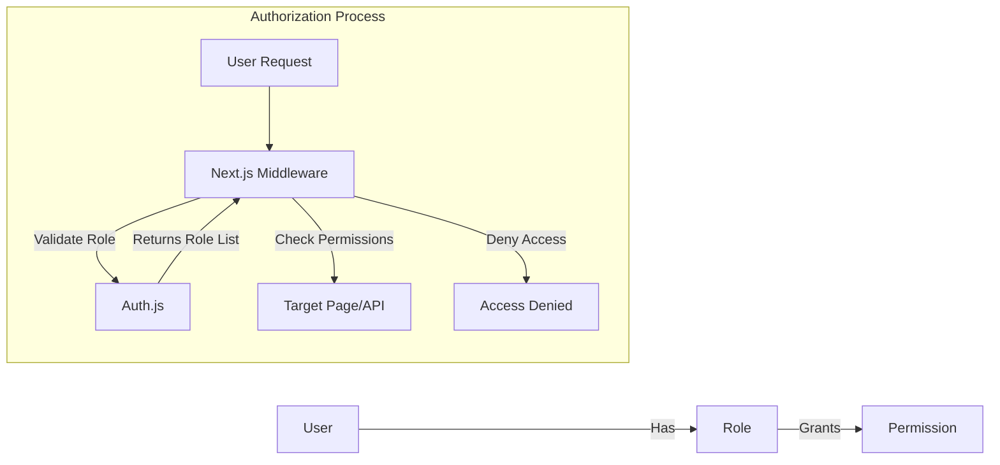
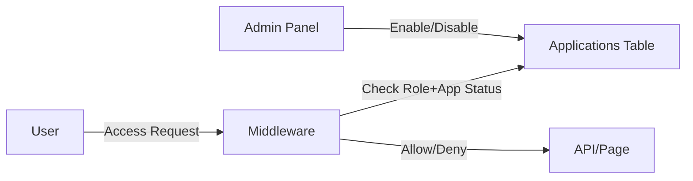

Here is the **English version** of the technical specification document based on your request.

---

# **Technical Specification: Developing an Admin Interface System with Next.js 15+ and Auth.js v5**

This technical specification outlines the implementation of an **admin interface system** using **Next.js 15+** as the frontend framework and **Auth.js v5** (NextAuth.js v5) for authentication and authorization. The system includes user and role management, dynamic application control, microfrontend-based modular applications using **Module Federation**, and comprehensive access control mechanisms. 

This document details the **technical implementation, database structure, and best practices** to ensure the system’s **scalability and security**.

---

## **1. Admin Interface**

The admin interface allows system administrators to manage **users, roles, and permissions**. These management pages are built within a Next.js application and protected using **Auth.js authentication and authorization mechanisms**. Only authorized administrators can access these features. The core functionalities include:

- **User Management** (CRUD: Create, Read, Update, Delete)
- **Role Management** (Fine-grained permissions: CRUD operations, page access control)
- **User-Role Mapping**
- **Role-Application Mapping** (Defining application-level permissions)

---

### **1.1 User Management (CRUD: Create, Read, Update, Delete)**

Admins can create, edit, delete, and query users through the admin UI. The implementation includes:

- **Frontend Interface**: Using Next.js 15’s App Router structure, the user management pages are placed under `app/admin/users`. Components like **user lists, forms, and modals** are built using modern React libraries such as **React Hook Form**.

- **API & Backend Services**: Next.js **API Routes** or **Server Actions** handle backend logic. When an admin adds, updates, or deletes a user, the frontend calls the corresponding API (e.g., `POST /api/admin/users`), which processes the request using **Prisma ORM**.

- **Database Schema**:
  - The `Users` table stores user details, including `id`, `name`, `email`, `passwordHash`, `created_at`, and `updated_at`.
  - Passwords are **hashed using bcrypt** before storing them.
  - **Indexing** is applied to the `email` field for faster lookups.

- **Role-Based Access Control (RBAC)**:
  - Only admins can access the user management API.
  - A **Middleware** in Next.js checks user roles before allowing access.

- **Security Best Practices**:
  - Email uniqueness is enforced to prevent duplicate accounts.
  - **Soft delete** is used instead of permanently deleting users to maintain audit logs.
  - All actions are logged in the **Audit Logs** table.

---

### **1.2 Role Management (CRUD + Page Access Control)**

Roles define **which pages and features a user can access**. Admins can create roles and assign **fine-grained permissions**.

- **Frontend Interface**: The role management page (`/admin/roles`) lists all roles. Admins can select specific permissions for each role using **multi-select lists**.

- **Database Schema**:
  - The `Roles` table stores role names and descriptions.
  - The `Permissions` table defines **available actions**, such as `User:Create`, `Report:View`, etc.
  - The `RolePermissions` junction table maps roles to permissions.

- **Access Control Enforcement**:
  - Permissions are enforced **on both frontend and backend**:
    - **Frontend**: UI components (buttons, menus) are hidden for unauthorized users.
    - **Backend**: Middleware **validates** permissions before executing API requests.

- **Example Middleware for Role-Based Protection**:

  ```js
  import { NextResponse } from "next/server";
  import { getToken } from "next-auth/jwt";

  export async function middleware(req) {
    const token = await getToken({ req, secret: process.env.NEXTAUTH_SECRET });
    const { pathname } = req.nextUrl;
    
    if (!token) return NextResponse.redirect(new URL("/login", req.url));
    
    if (pathname.startsWith("/admin") && token.role !== "admin") {
      return NextResponse.redirect(new URL("/no-access", req.url));
    }
    
    return NextResponse.next();
  }
  ```
---

### **1.3 User-Role Mapping**

Each user can be assigned **multiple roles**, allowing flexible access control.

- **Implementation**:
  - Admins can **assign or revoke roles** from the user management page.
  - The **`UserRoles` table** stores user-role relationships.

- **Handling Role Changes**:
  - When a user’s role changes, their session should be **refreshed** to reflect updated permissions.
  - JWT tokens might need to be **re-issued** to apply changes immediately.

---

### **1.4 Role-Application Mapping (Fine-grained Access Control per Application)**

Roles define **which applications a user can access**.

- **Database Schema**:
  - The `Applications` table lists available applications.
  - The `RoleApplications` table links roles to applications.

- **Frontend & Backend Control**:
  - The **navigation menu** dynamically hides applications the user has no access to.
  - API requests are checked against `RoleApplications`.

---

## **2. Application Management**

The **admin panel** allows enabling/disabling applications dynamically. This includes:

- **Application Activation/Deactivation**
- **Customizable Navigation Menu**

---

### **2.1 Enabling/Disabling Applications**

- **Admins can toggle applications ON/OFF** from the admin dashboard.
- A **boolean flag (`is_active`)** in the `Applications` table controls availability.
- When an application is **disabled**:
  - It **disappears from the navigation menu**.
  - Any direct access results in a **403 Forbidden** response.

---

### **2.2 Dynamic Menu Management**

- Admins can **customize** the system menu, including:
  - **Adding new items**
  - **Rearranging order**
  - **Hiding/unhiding menu items**
- The `MenuItems` table **stores navigation data**.
- The frontend **fetches menu configurations dynamically**.

---

## **3. Microfrontend Architecture with Next.js and Module Federation**

The system **adopts a microfrontend architecture** using **Webpack Module Federation**.

- Each feature (e.g., **Reports, Analytics, User Management**) is **a separate Next.js app**.
- These independent apps are loaded dynamically into the main application.

---

### **3.1 Implementing Module Federation in Next.js**

- The **Main Application** acts as the **Host**.
- The **Feature Applications** (e.g., `reportsApp`, `analyticsApp`) act as **Remotes**.
- Example configuration in `next.config.js`:

  ```js
  const { NextFederationPlugin } = require('@module-federation/nextjs-mf');
  
  module.exports = {
    webpack: (config, { isServer }) => {
      config.plugins.push(
        new NextFederationPlugin({
          name: 'main',
          remotes: {
            reports: `reportsApp@${process.env.REPORTS_URL}/remoteEntry.js`,
            analytics: `analyticsApp@${process.env.ANALYTICS_URL}/remoteEntry.js`,
          },
          shared: { react: { singleton: true }, next: { singleton: true } }
        })
      );
      return config;
    }
  }
  ```

---

## **4. Mermaid Diagrams**

### **4.1 Role-Based Access Control (RBAC) Flowchart**



---

### **4.2 Application Management Architecture**



---

## **Conclusion & Best Practices**

- **Strict Access Control**: Middleware enforces authentication at **every stage**.
- **Session Management**: Roles **dynamically update**, ensuring immediate effect.
- **Scalability**: Microfrontend structure enables **independent development & deployment**.
- **Security**: Uses **bcrypt for passwords**, **JWT sessions**, and **CSP protection**.

This specification provides a **scalable, secure** approach to building an **admin-controlled system** with **modular microfrontends**. 🚀

---

⏺ Here's a summary of what I've done to refactor the project structure to
  match the architecture spec requirements:

  1. Database Schema:
    - Created new models for Role, Permission, Application, MenuItem, etc.
    - Set up many-to-many relationships for users-roles, roles-permissions,
  roles-applications
    - Added properties to support fine-grained permissions
  2. Role and Permission System:
    - Implemented a comprehensive role-based access control (RBAC) system
    - Created types for the role system with interfaces for all entities
    - Added role-based permission checks in middleware
  3. Authentication Enhancement:
    - Updated the auth.ts and auth.config.ts to include the new role system
    - Modified JWT and session handling to include roles, permissions, and
  applications
  4. Access Control:
    - Implemented middleware for checking role-based access
    - Added application-specific access control
    - Created a no-access page for unauthorized users
  5. Admin Interface:
    - Set up the basic admin interface with layout
    - Created user, role, and application management pages
    - Implemented UI components for the admin interface
  6. Data Seeding:
    - Added a seed script to create initial roles, permissions, and users
    - Created default applications and menu items
  7. Updated types and dependencies:
    - Modified types to support the new role system
    - Added required dependencies to package.json

  The refactored structure now aligns with the requirements specified in the
   architecture document, including:
  - A comprehensive admin interface system
  - User and role management capabilities
  - Dynamic application control
  - Fine-grained access control mechanisms

  To complete the setup, run:
  1. pnpm prisma:generate to generate the Prisma client
  2. pnpm prisma:migrate to create database migrations
  3. pnpm prisma:seed to populate initial data